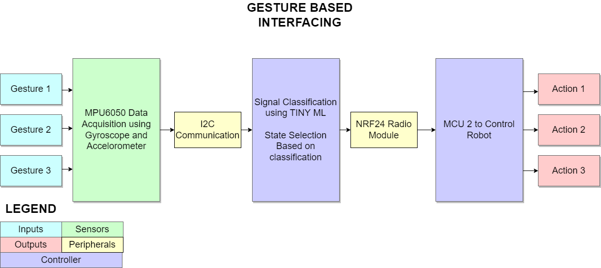

# Gesture Recognition using TinyML

This project was done for the Embedded Systems Course taken in 7th Semester @FAST-NUCES, Islamabad.
## Description
Gesture recognition is a technology that interprets human gestures to allow people to interact with their devices without touching buttons or displays. This technology is now  
in various consumer electronics (for example, smartphones and game consoles) and involves two principal ingredients: a sensor and a software algorithm. 

In this project we will show you how to use accelerometer measurements in conjunction with Machine Learning (ML) to hand gestures with the Raspberry Pi Pico. These gestures 
can then be applied to perform any function of our choosing. 

We will start by collecting the accelerometer data to build the gesture recognition dataset. In this part, we will learn how to interface with the I2C protocol and use the Edge 
Impulse data forwarder tool. Next, we will focus on the Impulse design, where we will build a spectral-features-based fully connected neural network for gesture recognition. 

### Block Diagram

## Devices Used
- 0: Raspberry Pi PICO Microcontroller
- 1: Arduino UNO Microcontroller
- 2: NRF24 Transciever Module
- 3: MPU6050 Accelerometer & 3-axis gyroscope

## Acquiring Data
We used a tool called EDGE IMPULSE data forwarder to collect data from the MCU and input it into the EDGE IMPULSE tool. EDGE Impulse is an online tool that helps developers to create datasets, models and then deploy those models on EDGE Devices. The screenshot below shows the EDGE Impulse data forwarded being used to connect the microcontroller with the tool.

## Deep Learning
For our problem we used a classification model. Considering the data was simple, a simple NN architecture was sufficient. The architecture consisted of a few dense layers and a dropout layer to avoid overfitting. 
Once the model was trained, we evaluated the model which gave a 96% accuracy as shown below. This was later increased to 99% accuracy by making a better dataset. 

